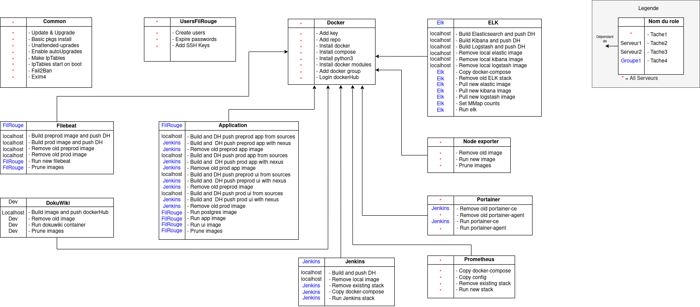

# Ansible avec docker

Les roles sont reparties sur 4 serveurs.

## Pre-production

- common
- usersfilrouge
- docker
- filebeat
- bibliothequeapplication
- dokuwiki
- nodeexporter
- portainer

## Production

- common
- usersfilrouge
- docker
- filebeat
- bibliothequeapplication
- nodeexporter
- portainer

## ELK

-common }
-usersfilrouge }
-docker }
-elk }
-portainer }
-nodeexporter }

## Jenkins

- common
- usersfilrouge
- docker
- jenkins
- portainer
- bibliothequeapplication
- prometheus

## Cartographie

### Rôles, tâches et dépendances

### Tags

